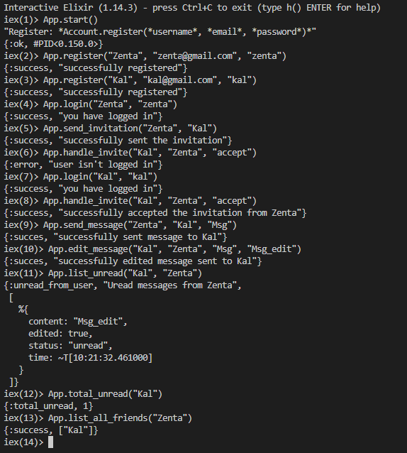

# Elixir projects

A collection of Elixir assignments and projects that I worked on during my internship at Quanterall Academy.

## ChatApp

This app’s purpose is to function as a server for storing users and relationships between them, as well as keeping track of messages that have been sent between friends.

<p align="center">
  <br/>
</p>

### Test Data
```
App.start()
App.register("Zenta", "zenta@gmail.com", "zenta")
App.register("Kal", "kal@gmail.com", "kal")
App.register("Iva", "iva@gmail.com", "iva")
App.login("Zenta", "zenta")
App.login("Kal", "kal")
App.send_invitation("Zenta", "Kal")
App.send_invitation("Iva", "Kal")
App.handle_invite("Kal", "Zenta", "decline")
App.handle_invite("Kal", "Zenta", "accept")

App.send_message("Zenta", "Kal", "Msg")
App.remove_message("Kal", "Zenta", "Msg")
App.edit_message("Kal", "Zenta", "Msg", "Msg_edit")
App.list_unread("Kal")
App.list_unread("Kal", "Zenta")
App.total_unread("Kal")
App.remove_friend("Zenta", "Kal")
App.list_chat("Zenta", "Kal")
App.list_all_friends("Zenta")
```
